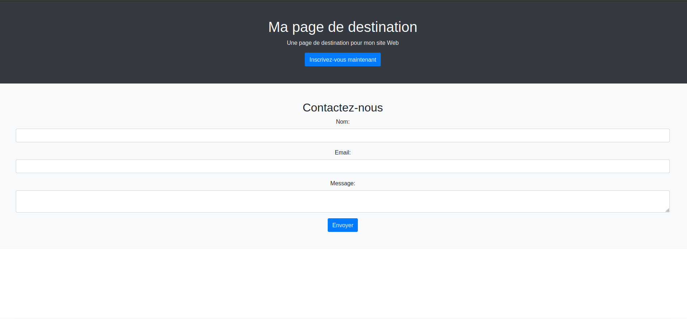
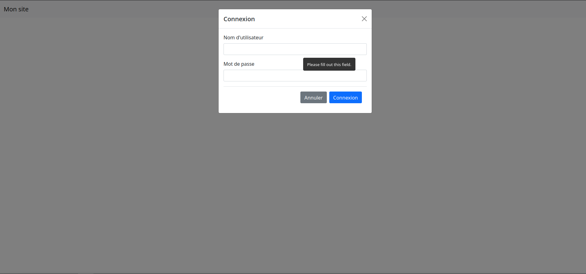

# **Workshop - Introduction to Bootstrap**

Durant ce Workshop, vous allez apprendre à créer une site web responsive avec le framework Bootstrap.

## **Qu'est-ce que Bootstrap**

Bootstrap est un framework (ensemble d'outils et de composants) open-source utilisé pour créer des sites web responsives et adaptatifs.
Il fournit des fonctionnalités prêtes à l'emploi pour la mise en page, la typographie, les formulaires, les boutons, les icônes et bien plus encore, ce qui permet aux développeurs de créer rapidement des sites web modernes et attractifs.
Bootstrap est largement utilisé dans l'industrie du web en raison de sa facilité d'utilisation et de sa compatibilité avec différents navigateurs et appareils.

## **STEP 0: Installation**

Aujourd'hui, aucune installation ne sera nécessaire, nous inclurons tout simplement le framework bootstrap grâce à cette ligne :
`<link rel="stylesheet" href="https://stackpath.bootstrapcdn.com/bootstrap/4.5.2/css/bootstrap.min.css">`

## **Comment faire ?**
Vous trouverez chaque exercice dans les fichiers nommé (ex1/exercice1, ex2/exercice2...).

## **STEP 1: Créer une page de destination responsive**
Le but de l'exercice est de completer le code afin de rendre une page responsive. TIPS: (container-fluid).
Le résultat final de ce premier exercice devrait plus ou moins ressembler à ceci :

## **Documentation**
Pour vous documenter sur bootstrap vous pouvez tout simplement vous rendre sur le site Web de bootstrap : https://getbootstrap.com/

## **STEP 2: Créer un menu de navigation responsive**
Ce deuxième exercice a pour but de vous apprendre à faire une Navbar de manière responsive, c'est-à-dire un menu de navigation qui s'adapte à n'importe quel taille d'écran. Compléter le code. Le résultat final doit ressembler à ceci :

## **STEP 3: Créer une galerie d'images responsive avec une lightbox**
Ce troisième exercice a pour objectif de vous apprendre à utiliser des lightbox, mais également faire en sorte que la page crée sois responsive.
Compléter le code. Le résultat final doit ressembler à ceci :

Voici un début de code afin d'importer des images déjà existantes:
`<a href="https://picsum.photos/id/70/1200/800" data-toggle="lightbox" data-gallery="gallery1"> `
Il ne faut pas oublier que ce morceau de code se trouvera dans une `
`

## **STEP 4: Utiliser les icônes Bootstrap**
Dans ce quatrième exercice vous allez apprendre à ajouter des icônes à votre page en utilisant la bibliothèque d'icônes de Bootstrap 5. Les icons que vous allez créer devront avoir comme id "linkedin", "github", "book" pour pouvoir s'adapter au fichier css fournit. Compléter le code. Le résultat final doit ressembler à ceci :
:[ex4](ex4/ex4screen.png)

## **STEP 5: Créer un menu déroulant**
Dans ce cinquième et avant dernier exercice vous allez Créez un menu déroulant en utilisant les classes Bootstrap pour afficher une liste de choix dans un menu déroulant. Il faut savoir qu'un morceau de code existe déjà en javascript et css, il n'y a aucun intérêt à les modifier. Compléter le code. Le résultat final doit ressembler à ceci :
:[ex5](ex5/ex5screen.png)

## **STEP FINAL:  Créer une page de connexion avec une modale**
Ce dernier exercice va vous permettre d'aborder... Un formulaire de connexion Responsive. Grâce aux exercices précédents, celui-ci devrait être simple. N'oubliez pas la documentation. Compléter le code. Le résultat final doit ressembler à ceci :

### **MERCI**
Merci d'avoir suivi ce Workshop vous avez maintenant de très bonnes bases pour faire un site web avec le framework Bootstrap. À vous de jouer pour créer votre propre site Web !